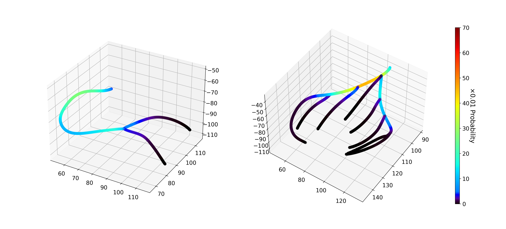

## Table of Contents
- [Introduction](#introduction)
- [Quick start](#quick-start)
- [Usage details](#usage-details)
  - [Step 1: Averaging_Ctl](#averaging_ctl)
  - [Step 2: Plaque_mapping](#plaque_mapping)
  - [Step 3: Visualization](#visualization)
- [Data & Folder Descriptions](#data--folder-descriptions)


## Introduction

This repository is the official implementation of plaque atlas construction for **“Deciphering Age- and Sex-Specific Patterns of Coronary Artery Atherosclerosis: Multi-Level Insights from a Large Cohort Study in China”**.

This work aims to advance the understanding of the prevalence, progression, and characteristics of coronary atherosclerosis across different age and sex groups. We carried out a retrospective, consecutive, multi-center cohort study of 16,300 patients in China who underwent clinically indicated CCTA. By leveraging an AI-based coronary computed tomography angiography (CCTA) analysis system, we conducted a comprehensive analysis of the atherosclerotic plaque phenotypes at the patient-, segment- and point-levels. In this process, a series of three-dimensional (3D) coronary atlases that reveal statistical fine-grained spatial distribution of atherosclerotic plaques with their characteristics are constructed. 

Here in this repository, we share the source code for constructing these atlases and provide example data for running it due to data sharing restrictions. Additionally, we provide statistical data derived from the study cohort (N=16,300):
- The 3D point set of the mean shape of coronary artery tree.
- Frequency of each segment following AHA-18 coronary artery segmenting standard stratified by age and sex groups.
- Atlases revealing statistical fine-grained spatial distribution of plaques, stenosis, and high-risk features stratified by age and sex groups.

<div align="center">
  
  <p><b>Figure 1.</b> Plaque prevalence atlas of the entire cohort.</p>
</div>

## Quick start

1. The project runs in Python 3.9 environment with CPU.
    ```bash
    conda create -n PS_CTA_Plaque_Atlas python=3.9
    conda activate PS_CTA_Plaque_Atlas
    pip install -r requirements.txt
    ```
    
3. Run the `demo.py` for generate plaque mapping files and visualize atlases.
    
    ```bash
    python demo.py
    ```
## Usage details
In `demo.py`, three steps are conducted:

#### `Averaging_Ctl()`
- Calculate the mean centerline shape of coronary tree as the template.
- `Averaging_Ctl().reorganize()` can be independently executed to get the targeted results with `mean_segment_shapes.json` and `mean_concat_pts.json` as inputs, derived from the whole cohort, instead of example data.
- `Averaging_Ctl().show_avg_shapes()` can be independently executed to visualize the centerline template.

#### `Plaque_mapping()`
- Mapping plaques detected in the cohort along with their characteristics to the template. Results aggregate characteristics of plaque mapped to a point in the coronary artery template as a set. Here, we obtain results from the example data.

#### `Visualization()` 
- Statistical analysis and visualization of plaque characteristics stratified by age and sex groups.
The atlas data from the study cohort serves as inputs, rather than the example data. 
- `Visualization().prevalence_ctl_dist()`: visualization of plaque prevalence atlases.
- `Visualization().char_ctl_dist()`: visualization of atlases related to stenosis, and high-risk features.

  Since the atlas data from our cohort was directly used, the statistical analysis part has been commented out. However, if needed, you can uncomment the relevant sections in the code to compute the atlas data based on the results from the previous step. The core function for this is `Visualization().get_draw_dict()`.
              
- **Note**: we use a small subset as example data here. Therefore, it is not accurate to calculate atlas data from the results of the previous step. To use your own data, ensure that plaque information and segment counts for a cohort with a sufficient number of subjects are provided to obtain statistically meaningful results.

## **Data & Folder Descriptions**

```
Plaque_Population_Study/
├── sample_data/                  # Folder containing sample data
│   ├── statistics/               # Number of points for centerline resampling 
│   ├── intersection/             # centerline intersection points
│   ├── centerline_internal/      # centerline files (Type 1)
│   ├── sCPR_ctl_lm/              # centerline files (Type 2)
│   ├── average_shape_results/    # Average shape results and byproducts of code

│   ├── cohort.csv                # Example: Cohort metadata
│   ├── integrated_feature_table_samples.csv  # Example: plaque feature table

├── results_demo/                 # Results
│   ├── subject_level/            # Example: subject-level analysis results
│   ├── segment_level/            # Example: segment-level analysis results
│   ├── point_level/              # Point-level analysis results for our cohort

├── figure/                       # figures for readme.md

├── demo.py                       # running demo
├── build_plaque_atlas.py         # Classes and functions for atlas construction
├── utils.py                      # Utility functions for data processing
```

1. **`sample_data/`**: contains all input data, including:
    1. `statistics/mean_number_of_points.json`: number of points for centerline resampling
    2. `centerline_internal/`: parsing centerlines that consider LAD and LM as one whole vessel.
    3. `sCPR_ctl_lm/`: parsing centerlines that split LAD and LM.
    4. `intersection/`: intersection points of centerlines of the example data (5 subjects).
    5. `average_shape_results/`:
        - `mean_segment_shapes.json` is the mean centerline shape of each individual segment in our cohort. `mean_concat_pts.json` stores the estimated intersection points on the mean segment shapes.
        - `mean_TREE_shapes.json` is the mean shape of coronary artery tree of our cohort.  `TREE_concat_pts.json` are intersection points on the reorganized coronary artery tree.
        - Other files are byproducts during execution of `Averaging_Ctl().execute()`
    6. `cohort.csv`: metadata of example data
    7. `integrated_feature_table_samples.csv`: characteristics of CCTA-detected plaques of example data.
2. **`results_demo/`**: results at different analysis levels (subject, segment, point).
    1. `subject_level/`: example of subject-level analysis table
    2. `segment_level/`: 
        - `aha18_seglevel_volume_PAV_features_ste_samples.csv`: example of segment-level analysis table
        - `*_seg_num.json`: frequency of each segment following AHA-18 coronary artery segmenting standard in our cohort, stratified by age and sex groups.
    3. `point_level/position_analysis/`: 
        - `*_tmpctl.json`: coronary artery centerline template for plaque mapping. Equivalent to `mean_TREE_shapes.json` .
        - `Plaque_existence/`:
            - `*_plaexist_dict.json`: the plaque prevalence atlases derived from the study cohort. Stratified by age (5 groups: “<45”, "45-55", "55-65", "65-75", ">=75”) and sex (two groups: female and male).
            - `plots_views/`: visualization of `*_plaexist_dict.json` .
        - `high_risk features/`:
            - `*_high_risk features_probs.json`: prevalence atlases of high-risk plaques, positive remodeling, low attenuation plaque, napkin ring sing, and spotty calcification, accompanied with their prevalences conditioned on the existence of plaques. Derived from our cohort and stratified by age and sex groups.
            - `plots_views/`: visualization of `*_high_risk features_probs.json` .
        - `stenosis/`:
            - `*_stenosis_probs.json`: atlases of obstructive stenosis plaques (≥50% stenosis ratio) prevalence, accompanied with its prevalence conditioned on the existence of plaques, and atlases of mean stenosis ratio. Derived from our cohort and stratified by age and sex groups.
            - `plots_views/`: visualization of `*_stenosis_probs.json`.
    
3. **`demo.py`**: main script to generate the plaque atlas.
4. **`build_plaque_atlas.py`**: classes and functions for atlas construction.
5. **`utils.py`**: utility functions for data processing.

**Note**: all files with names ending in `_samples` are example data and their corresponding results.

---
